# RealWorld Application - System Design Document

## Table of Contents
1. [System Overview](#system-overview)
2. [Architecture Design](#architecture-design)
3. [Frontend Design](#frontend-design)
4. [Backend Design](#backend-design)
5. [Database Design](#database-design)
6. [API Design](#api-design)
7. [Security Design](#security-design)
8. [Performance Design](#performance-design)
9. [Deployment Architecture](#deployment-architecture)
10. [Development Workflow](#development-workflow)

---

## 1. System Overview

### 1.1 System Context

The RealWorld application is a **Medium.com clone** called "Conduit" that demonstrates modern full-stack development practices. This system serves as a comprehensive learning resource and production-ready example.

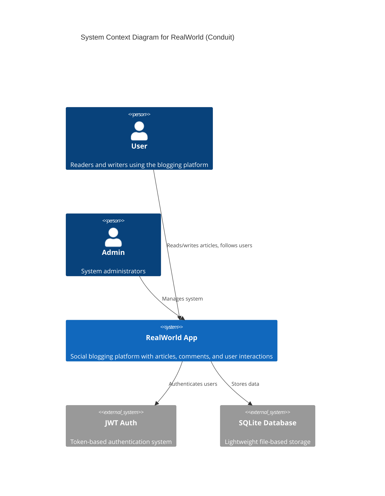

### 1.2 Key Design Principles

Based on the PRD and RealWorld guidelines:

- **Agent-Friendly Architecture**: Optimized for AI-assisted development
- **Function-First Design**: Prefer pure functions over complex object hierarchies
- **Specification-Driven**: Adheres to RealWorld API specification
- **Minimal Dependencies**: "Dumbest possible thing that works" approach
- **Explicit Context**: Clear request scoping and error handling

---

## 2. Architecture Design

### 2.1 High-Level Architecture

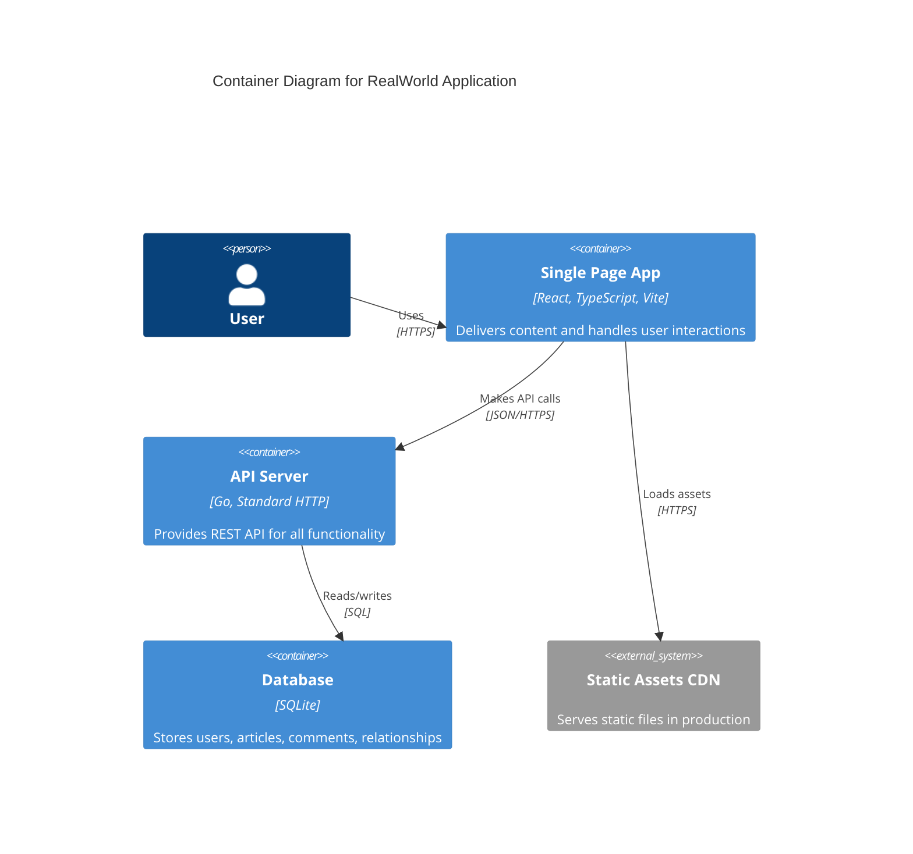

### 2.2 Technology Stack Rationale

| Layer | Technology | Rationale |
|-------|------------|-----------|
| **Frontend** | React 18 + TypeScript | Type safety, modern React patterns, extensive ecosystem |
| **Build Tool** | Vite | Fast HMR, optimized builds, ES modules support |
| **Routing** | TanStack Router | Type-safe routing, hash-based navigation |
| **State Management** | TanStack Query | Server state caching, optimistic updates |
| **UI Framework** | Tailwind CSS + Shadcn/UI | Utility-first styling, consistent components |
| **Backend** | Go 1.21+ | Simple deployment, excellent performance, strong typing |
| **HTTP Framework** | Standard library | Minimal dependencies, maximum control |
| **Database** | SQLite | Zero-config, file-based, perfect for demos |
| **Authentication** | JWT | Stateless, scalable, industry standard |

---

## 3. Frontend Design

### 3.1 Component Architecture

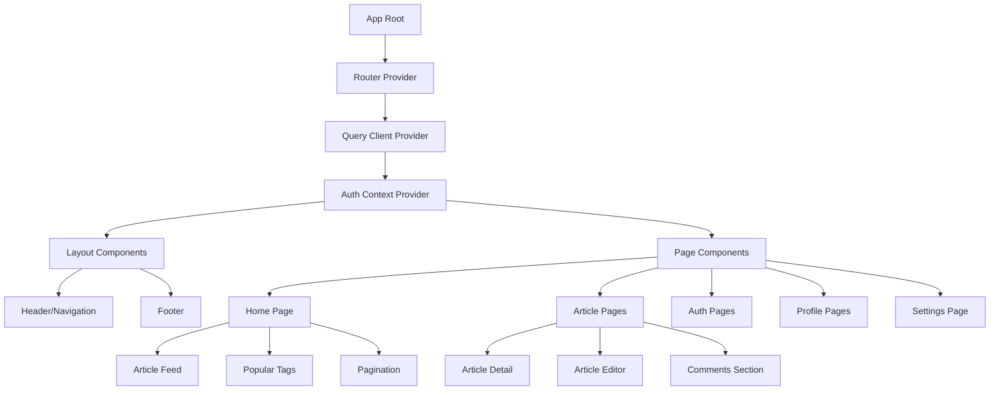

### 3.2 State Management Strategy

#### 3.2.1 Server State (TanStack Query)
- **Articles**: Cached with tags, automatic invalidation
- **User Profiles**: Cached with stale-while-revalidate
- **Comments**: Real-time updates with optimistic mutations
- **Authentication**: Token refresh and session management

#### 3.2.2 Client State (React Context)
- **Theme**: Dark/light mode preference
- **UI State**: Loading states, modal visibility
- **Form State**: Article editor, comment forms

### 3.3 Routing Structure

```mermaid
graph LR
    A[/#/] --> B[Home Feed]
    A --> C[/#/login] 
    A --> D[/#/register]
    A --> E[/#/settings]
    A --> F[/#/editor]
    A --> G[/#/editor/:slug]
    A --> H[/#/article/:slug]
    A --> I[/#/profile/:username]
    A --> J[/#/profile/:username/favorites]
    
    B --> K[Global Feed Tab]
    B --> L[Personal Feed Tab]
    B --> M[Tag Feed Tab]
```

### 3.4 Component Design Patterns

#### Atomic Design Structure
- **Atoms**: Button, Input, Avatar, Tag
- **Molecules**: ArticlePreview, CommentForm, UserInfo
- **Organisms**: ArticleFeed, CommentsList, Navigation
- **Templates**: PageLayout, AuthLayout
- **Pages**: HomePage, ArticlePage, ProfilePage

---

## 4. Backend Design

### 4.1 Service Architecture

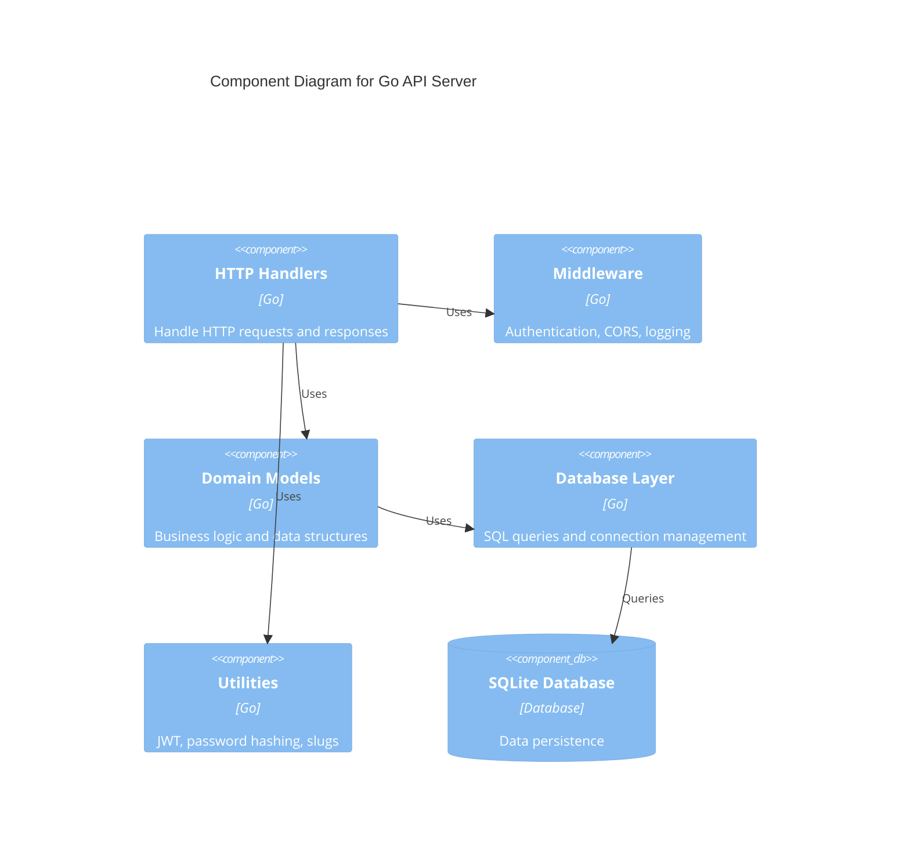

### 4.2 Handler Pattern

```go
type Handler struct {
    db     *sql.DB
    logger *log.Logger
}

func (h *Handler) CreateArticle(w http.ResponseWriter, r *http.Request) {
    // 1. Extract context and user
    ctx := r.Context()
    user := getUserFromContext(ctx)
    
    // 2. Validate request
    var req CreateArticleRequest
    if err := decodeJSON(r.Body, &req); err != nil {
        respondError(w, http.StatusBadRequest, "Invalid request")
        return
    }
    
    // 3. Business logic
    article, err := h.createArticle(ctx, user.ID, req)
    if err != nil {
        h.logger.Printf("Error creating article: %v", err)
        respondError(w, http.StatusInternalServerError, "Failed to create article")
        return
    }
    
    // 4. Respond
    respondJSON(w, http.StatusCreated, ArticleResponse{Article: article})
}
```

### 4.3 Middleware Stack

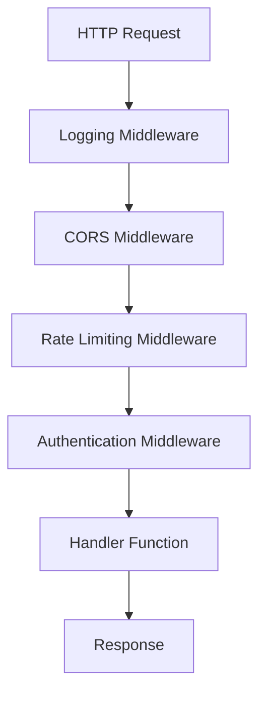

---

## 5. Database Design

### 5.1 Entity Relationship Diagram

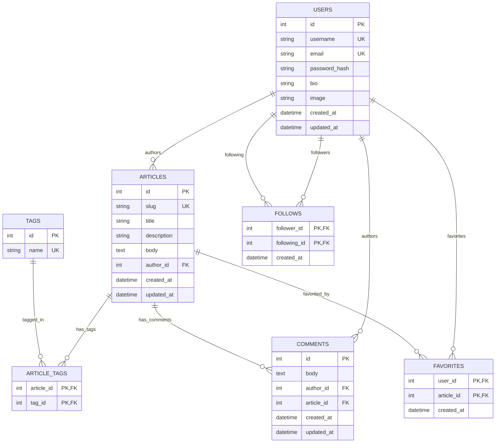

### 5.2 Indexing Strategy

```sql
-- Performance indexes from PRD
CREATE INDEX idx_articles_author_id ON articles(author_id);
CREATE INDEX idx_articles_created_at ON articles(created_at DESC);
CREATE INDEX idx_comments_article_id ON comments(article_id);
CREATE INDEX idx_favorites_article_id ON favorites(article_id);
CREATE INDEX idx_follows_following_id ON follows(following_id);

-- Additional indexes for query optimization
CREATE INDEX idx_articles_slug ON articles(slug);
CREATE INDEX idx_users_email ON users(email);
CREATE INDEX idx_users_username ON users(username);
```

---

## 6. API Design

### 6.1 RESTful API Structure

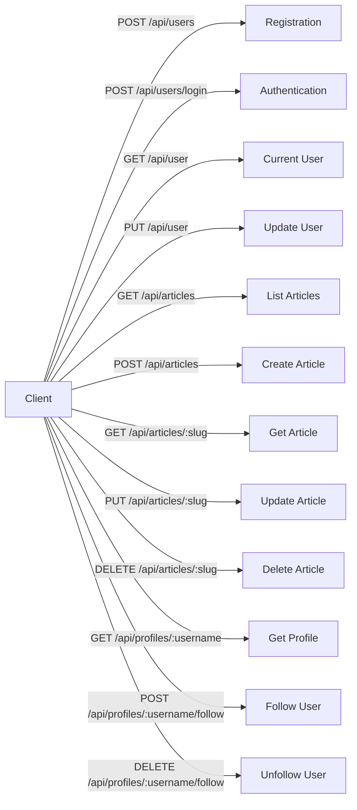

### 6.2 Request/Response Format

#### Standard Response Envelope
```json
{
  "user": { ... },      // Single user object
  "users": [ ... ],     // Array of users
  "article": { ... },   // Single article object  
  "articles": [ ... ],  // Array of articles
  "articlesCount": 10,  // Total count for pagination
  "comment": { ... },   // Single comment object
  "comments": [ ... ],  // Array of comments
  "tags": [ ... ],      // Array of tag strings
  "errors": { ... }     // Validation errors
}
```

#### Error Response Format
```json
{
  "errors": {
    "email": ["is required"],
    "password": ["is too short"]
  }
}
```

### 6.3 Authentication Flow

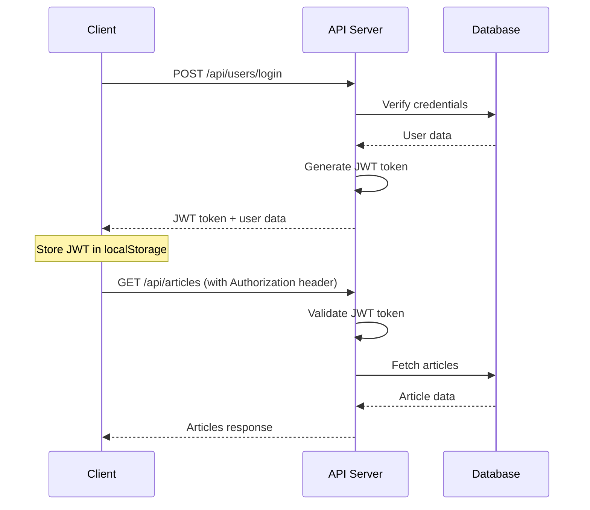

---

## 7. Security Design

### 7.1 Security Architecture

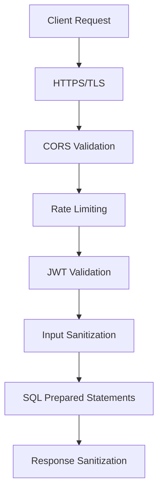

### 7.2 Authentication & Authorization

#### JWT Token Structure
```json
{
  "header": {
    "typ": "JWT",
    "alg": "HS256"
  },
  "payload": {
    "user_id": 123,
    "username": "johndoe",
    "exp": 1640995200
  }
}
```

#### Permission Model
- **Public**: View articles, profiles, comments
- **Authenticated**: Create articles/comments, follow users, favorite articles
- **Owner**: Edit/delete own articles/comments, update own profile

### 7.3 Security Measures

| Threat | Mitigation |
|--------|------------|
| **XSS** | Input sanitization, CSP headers, safe markdown rendering |
| **CSRF** | JWT tokens, SameSite cookies |
| **SQL Injection** | Prepared statements, input validation |
| **Brute Force** | Rate limiting, account lockout |
| **Data Exposure** | HTTPS only, secure headers |

---

## 8. Performance Design

### 8.1 Frontend Performance

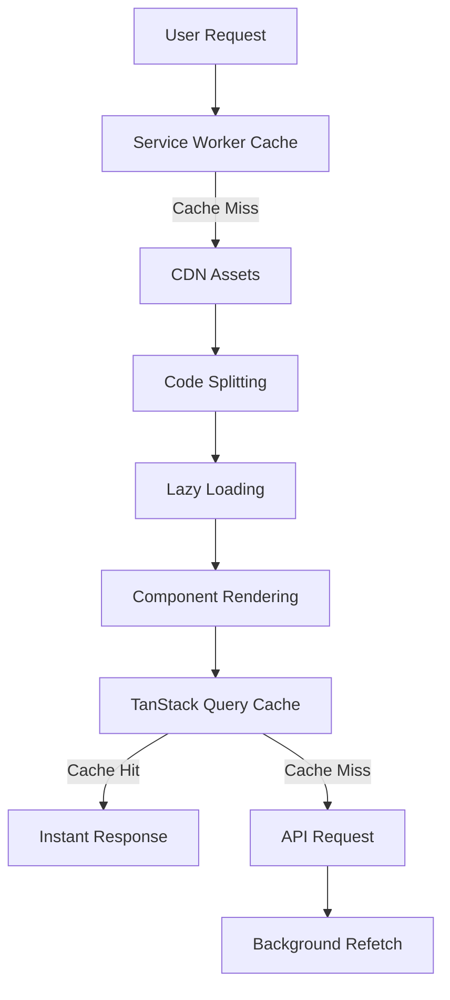

#### Optimization Strategies
- **Code Splitting**: Route-based and component-based
- **Tree Shaking**: Eliminate unused code with Vite
- **Asset Optimization**: Image compression, WebP format
- **Caching**: Aggressive caching with proper invalidation
- **Bundle Analysis**: Regular size monitoring

### 8.2 Backend Performance

#### Database Query Optimization
```sql
-- Optimized article feed query
SELECT 
  a.id, a.slug, a.title, a.description, a.created_at,
  u.username, u.bio, u.image,
  COUNT(f.user_id) as favorites_count,
  EXISTS(SELECT 1 FROM favorites f2 WHERE f2.article_id = a.id AND f2.user_id = ?) as favorited
FROM articles a
JOIN users u ON a.author_id = u.id
LEFT JOIN favorites f ON a.id = f.article_id
WHERE a.created_at < ?
GROUP BY a.id
ORDER BY a.created_at DESC
LIMIT 20;
```

#### Performance Metrics
- **API Response Time**: < 200ms average
- **Database Queries**: < 50ms average
- **Memory Usage**: < 100MB baseline
- **Concurrent Users**: 1000+ supported

---

## 9. Deployment Architecture

### 9.1 Development Environment

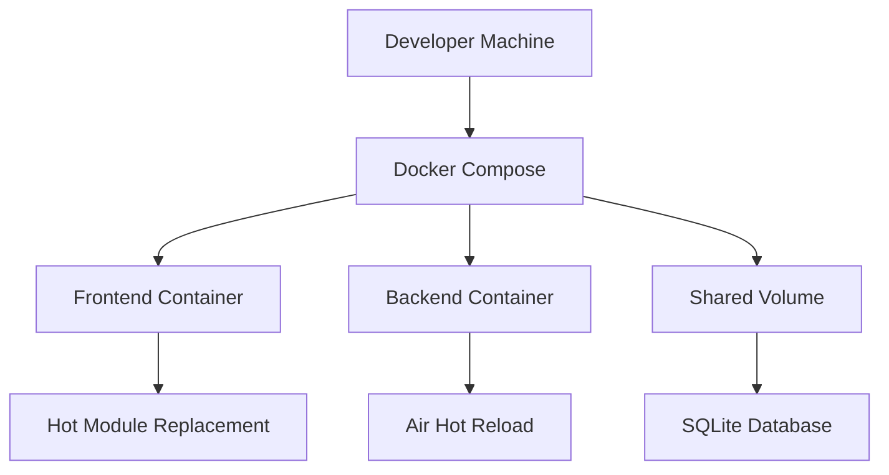

### 9.2 Production Deployment

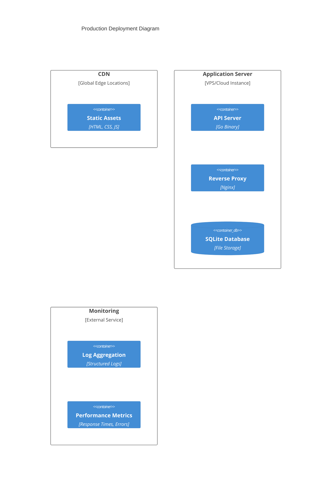

### 9.3 Docker Configuration

#### Multi-stage Build Strategy
```dockerfile
# Frontend Production Build
FROM node:18-alpine as build
WORKDIR /app
COPY package*.json ./
RUN npm ci --only=production
COPY . .
RUN npm run build

FROM nginx:alpine as production
COPY --from=build /app/dist /usr/share/nginx/html
```

---

## 10. Development Workflow

### 10.1 Git Workflow

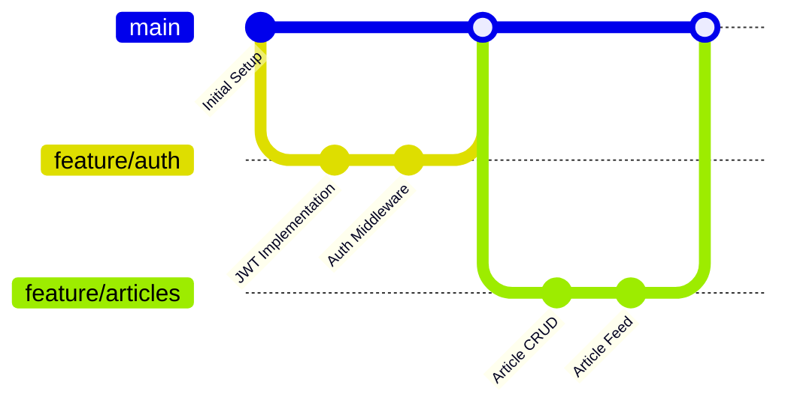

### 10.2 Testing Strategy

```mermaid
pyramid
    title Testing Pyramid
    
    layer E2E["E2E Tests (Playwright)"]
    layer Integration["Integration Tests (API + DB)"]
    layer Unit["Unit Tests (Go + React)"]
    
    E2E --> Integration : "Critical user journeys"
    Integration --> Unit : "API endpoints + Components"
    Unit : "Functions + Utilities"
```

### 10.3 CI/CD Pipeline

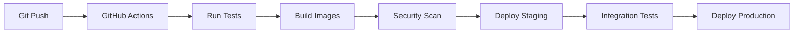

---

## Conclusion

This design document outlines a production-ready RealWorld application architecture that follows modern development practices and the RealWorld specification. The design emphasizes:

- **Simplicity**: Minimal dependencies and clear patterns
- **Scalability**: Stateless architecture with efficient caching
- **Maintainability**: Function-first design with explicit error handling
- **Performance**: Optimized queries and frontend caching strategies
- **Security**: Comprehensive protection against common vulnerabilities

The architecture supports the project's goals of demonstrating real-world development patterns while maintaining the flexibility to adapt to different technology stacks and deployment scenarios.